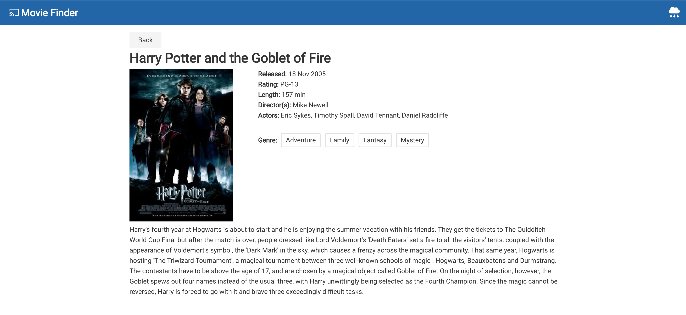

This project was bootstrapped with [Create React App](https://github.com/facebook/create-react-app).

# Goal

We would like you to build our own customized webapp.
Our app should introduce movie details and the weather.

# 3rd Party Apis

## Weather (WeatherMap)

- Site: https://openweathermap.org/api
http://api.openweathermap.org/data/2.5/weather?q=London,uk&APPID=<API_KEY>

## Movie (OMDB)
- Site: http://www.omdbapi.com/
http://www.omdbapi.com/?i=tt3896198&apikey=<API_KEY>

## Available Scripts

# Instruction to deploy:

To build:
```
npm install
npm run build
netlify deploy --prod
```

# Screens

## Home


## Movie Page


## Weather Indicator

Using useInterval and usePosition hooks to trigger update on location change or timer.
